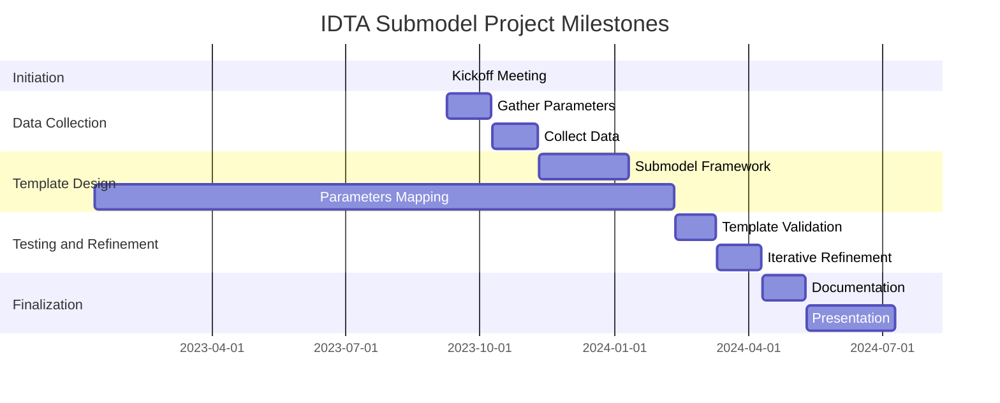
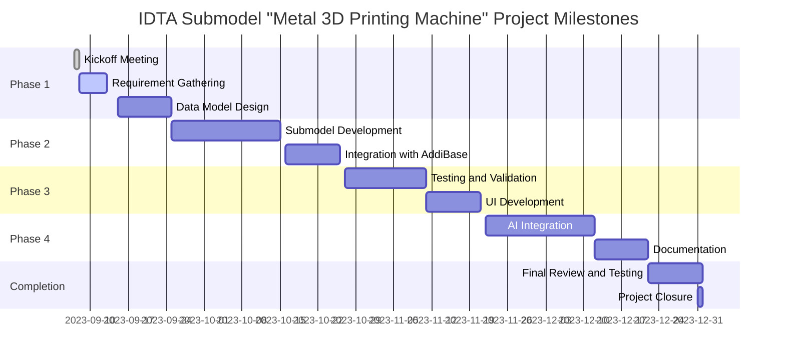
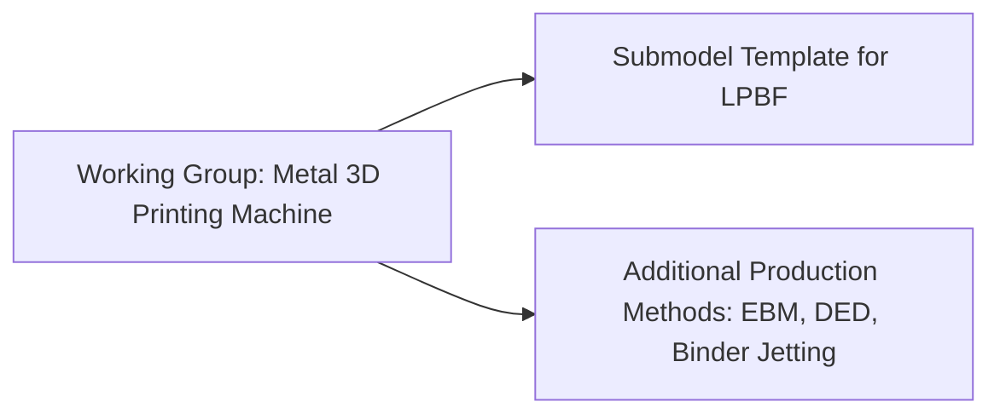

# IDTA_submodel_metal_additive_manufacturing
IDTA Submodel "Metal 3D Printing Machine"

## Agenda: KickOff Meeting - IDTA Submodel "Metal 3D Printing Machine" Working Group
### (1.5 hours - 13:00 to 14:30)

1. **Welcome and Introductions** *(5 mins)*
    - Brief overview of the meeting's purpose.
    - Introduction of attendees and their roles.

2. **Project Overview and Goals** *(10 mins)*
    - Explanation of the IDTA Submodel project's objectives and significance.
    - Clarification of the focus: Creating a submodel template for Laser Powder Bed Fusion for metal powders.

3. **Scope and Boundaries** *(15 mins)*
    - Clarification of the specific scope: Laser Powder Bed Fusion as the target production method.
    - Mention of the general submodel template concept and potential inheritance from other projects.
    - Connection to the AddiBase project and potential integration with OPC UA semantics.

4. **Work Breakdown Structure (WBS)** *(15 mins)*
    - Presentation of the high-level breakdown of tasks and phases in the project.
    - Discussion on the key milestones and deliverables.

5. **Technical Details and Requirements** *(15 mins)*
    - Overview of the technical aspects: What the IDTA Submodel template should encompass.
    - Discussion on capturing essential parameters, interoperability standards, and potential OPC UA semantics.

6. **Team Roles and Responsibilities** *(10 mins)*
    - Presentation of the core team members and their roles.
    - Discussion on potential collaboration with experts outside the working group.

7. **Timeline and Milestones** *(10 mins)*
    - Presentation of the project timeline and milestones, starting from the Kickoff on September 7th, 2023.
    - Avoiding meetings around holidays to ensure consistent progress.

8. **Communication and Meetings** *(10 mins)*
    - Discussion on communication channels (email, collaboration platforms, etc.).
    - Establishment of a regular meeting schedule (frequency, time).

9. **Open Discussion and Questions** *(10 mins)*
    - Opportunity for attendees to raise questions, concerns, or suggestions.

10. **Next Steps and Adjournment** *(5 mins)*
    - Recap of the meeting's key points and action items.
    - Confirmation of the next meeting date and time.
    - Meeting adjournment.

## Use Cases for IDTA Submodel Template Development

1. **Machine Selection and Comparison:**
   - **Use Case:** Manufacturers need to select and compare LPBF machines based on capabilities.
   - **Importance:** Parameters like build volume, laser power, and scanning speed aid in informed decision-making.

2. **Production Profile Optimization:**
   - **Use Case:** Optimizing production parameters for quality, efficiency, and material usage.
   - **Importance:** Parameters like layer temperature and build orientation enable fine-tuning of profiles.

3. **Quality Control and Traceability:**
   - **Use Case:** Ensuring consistent part quality and traceability for certified parts.
   - **Importance:** Process monitoring parameters, melt pool temperature, and powder distribution facilitate quality control.

4. **Process Monitoring and Maintenance:**
   - **Use Case:** Continuous process monitoring for anomaly detection and machine health.
   - **Importance:** Parameters like gas flow rates and energy consumption enable real-time monitoring.

5. **Data-Driven Process Improvement:**
   - **Use Case:** Analyzing historical data to identify trends for efficiency and quality improvements.
   - **Importance:** Parameters related to machine utilization, defects, and process variations aid in analysis.

6. **Interoperability and Data Exchange:**
   - **Use Case:** Seamless data exchange between LPBF machines and systems for collaboration.
   - **Importance:** Standardized data representation ensures interoperability across platforms.

7. **Training and Knowledge Transfer:**
   - **Use Case:** Training new operators and knowledge sharing for consistent production.
   - **Importance:** Including parameters and best practices aids in effective training.

8. **Cognitive Production Control and AI Integration:**
   - **Use Case:** AI-driven systems for production control and problem-solving.
   - **Importance:** Submodel should accommodate AI-generated insights and suggestions.

9. **Regulatory Compliance and Certification:**
   - **Use Case:** Adhering to regulations and certifications for industries like aerospace and medical.
   - **Importance:** Capturing parameters relevant to compliance ensures certified part production.

These use cases emphasize the diverse roles of the submodel template in enhancing LPBF processes, from machine selection to AI integration, ensuring comprehensive coverage and advancement of additive manufacturing.

---

### Project Outline: AddiBase - Enhancing Additive Manufacturing with IDTA Submodel Template and AI-driven Cognitive Production Control

**Introduction**

Additive manufacturing using metal powders for certified parts consists of complex sub-processes with many influencing parameters. The current practice of storing data in various formats leads to inefficiencies and errors in data acquisition. The AddiBase project aims to extend the existing Manufacturing Execution System with a material and process database for the Laser Powder Bed Fusion (LPBF) process. This database will be integrated with an IDTA Submodel Template for interoperability, allowing standardized data representation and seamless communication between different LPBF machines and systems. The project will also develop user-friendly Apps and a User Interface to facilitate data acquisition, analysis, and visualization. Additionally, we will explore the integration of generative AI and object-oriented AI systems for cognitive production control and problem-solving to enhance manufacturing processes.

**Project Objectives**

- Extend the Manufacturing Execution System with a material and process database, incorporating the IDTA Submodel Template for LPBF machines.
- Develop user-friendly Apps and a customizable User Interface to enable easy data acquisition and visualization for end-users.
- Implement automatic data import from existing servers to streamline data transfer and ensure comprehensive data coverage.
- Create an online catalog with detailed production profiles and parameter information for LPBF machines, enabling manufacturers to select suitable machines for their specific requirements.
- Integrate the AddiBase system with existing production planning systems to enhance production scheduling and resource allocation.
- Explore and incorporate generative AI and object-oriented AI systems for cognitive production control, predictive maintenance, and problem-solving.
- Leverage evolving AI capabilities over the next two years to enhance production efficiency, quality, and adaptability.

**Importance and Benefits**

- **Centralized Data Repository**: The integrated material and process database streamline data storage, reducing redundancy and errors.
- **Interoperability**: The IDTA Submodel Template fosters seamless communication and data exchange between LPBF machines and different systems, improving collaboration and data flow.
- **Online Catalog**: The online catalog empowers manufacturers to make informed decisions on selecting appropriate LPBF machines, optimizing production capabilities.
- **Data-Driven Decision Making**: The Apps' data visualization and analysis capabilities enable manufacturers to identify trends, anomalies, and potential improvements, fostering data-driven decision-making.
- **Enhanced Production Planning**: Integration with existing production planning systems improves production scheduling and resource allocation, leading to increased efficiency and cost-effectiveness.
- **Cognitive Production Control**: The integration of generative AI and object-oriented AI systems enables advanced production control, predictive maintenance, and problem-solving, improving overall manufacturing performance.

**Project Timeline**

**Scope of Work and Relations Plan**

