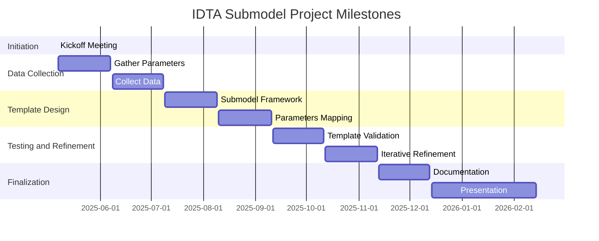

# IDTA Submodel for PBF-LB/M (LPBF Laser Powder Bed Fusion) Metal 3D Printing Machines

## Overview
This repository contains the draft for an **IDTA submodel template** (formerly called: Metal 3D Printing Machine) designed to standardize data representation for **Laser Powder Bed Fusion (LPBF) metal additive manufacturing machines**. The template facilitates **interoperability**, **data exchange**, and **process optimization** within the digital twin ecosystem of additive manufacturing.

## Project Milestones

## Key Use Cases
1. **Machine Comparison & Selection** - Enables evaluation of LPBF machines based on standardized parameters.
2. **Process Optimization** - Helps fine-tune printing parameters for better efficiency and quality.
3. **Quality Control & Traceability** - Ensures reproducibility through structured data tracking.
4. **Process Monitoring** - Allows real-time tracking of machine status and environment.
5. **Data-Driven Process Improvement** - Supports historical data analysis for performance enhancement.
6. **Interoperability & Integration** - Facilitates seamless communication across systems and platforms.
7. **AI Integration for Cognitive Production** - Enables predictive maintenance and automated decision-making.

## Additive Laboratory Ontology Big Picture:

    Main Classes:
    ├── Sample
    │   ├── Buildjob
    │   │   └── Buildjob_Number
    │   ├── Main_Sample_Number
    │   ├── Sample_Data
    │   │   ├── Analysis_Method
    │   │   ├── Division_Height
    │   │   ├── Grinding_Plane
    │   │   ├── Hybrid
    │   │   ├── Part_Coordinates_Cartesian
    │   │   └── Sample_Geometry
    │   └── Sample_Date
    ├── Machine
    │   ├── Manufacturer
    │   ├── Type
    │   └── Machine_Name
    ├── Material
    │   ├── Powder
    │   │   └── Powder_Batch
    │   ├── Environmental_Factors
    │   ├── Material_Name
    │   └── Material_Type
    ├── Parameter
    │   ├── Heat_Treatment
    │   │   └── Heat_Treatment_Parameters
    │   │       ├── Atmosphere
    │   │       ├── Cooling_Media
    │   │       ├── Cooling_Rates
    │   │       ├── Heat_Treatment_Curve
    │   │       ├── Heat_Treatment_Points
    │   │       ├── Heating_Rates
    │   │       └── Holding_Times
    │   └── LBPF
    │       ├── Border_Strategy
    │       │   └── Number_of_Borders
    │       ├── Gas
    │       │   └── Gas_Flow_Velocity
    │       ├── Laser
    │       │   ├── Downskin
    │       │   │   ├── Laser_Focus_(Downskin)
    │       │   │   ├── Laser_Power_(Downskin)
    │       │   │   └── Laser_Speed_(Downskin)
    │       │   ├── Hatch
    │       │   │   ├── Hatch_Distance_(Downskin)
    │       │   │   ├── Hatch_Distance_(Hatching)
    │       │   │   ├── Hatch_Distance_(Upskin)
    │       │   │   ├── Hatch_Offset_(Hatching)
    │       │   │   └── Rotation_Angle
    │       │   ├── Laser_Border
    │       │   │   ├── Beam_Compensation_(Border)
    │       │   │   ├── Laser_Focus_(Border)
    │       │   │   ├── Laser_Speed_Border
    │       │   │   └── Laserpower_(Border)
    │       │   ├── Laser_Hatching
    │       │   │   ├── Laser_Focus_(Hatching)
    │       │   │   ├── Laser_Power_(Hatching)
    │       │   │   └── Laser_Speed_(Hatching)
    │       │   ├── Upskin
    │       │   │   ├── Foucs_(Upskin)
    │       │   │   ├── Laser_Power_(Upskin)
    │       │   │   └── Laser_Speed_(Upskin)
    │       │   ├── Minimal_Exposure_Time
    │       │   └── Volume_Energy_Density
    │       ├── LPBF_Paramter_Set
    │       ├── Preheat_Temperatur
    │       └── Rates
    │           ├── Build_Up_Rate
    │           ├── Layer_Thickness
    │           └── Recoater_Velocity
    ├── Process
    ├── Characteristic
    │   ├── Chemical
    │   ├── Mechanical
    │   │   ├── Density_Archmidical
    │   │   ├── Hardness (Brinell, Shore, Vickers)
    │   │   └── Tests
    │   │       └── Tensile_Test
    │   └── Microstructure
    │       └── Micrograph
    │           ├── Density_Micrograph
    │           ├── Microstructure_Micrograph
    │           └── Porosity_Results
    │               ├── Average_Pore_Size
    │               ├── Number_of_Pores
    │               ├── Porosity_List
    │               └── Porosity_Standard_Deviation
    └── Property

Object Properties:
- Manufactured_With (Sample → Machine)
- Used_with (general property linking entities)

Data Properties:
- Datetime (Manufacturing_Date, Sample_Date → xsd:dateTime)
- Hardness (Brinell, Shore, Vickers → string)

## Additive Manufacturing Machine PBF-LB/M 

AM Machine Parameters Ontology Visualization:

    Machine (ex:Machine)
    ├── Manufacturer (ex:Manufacturer)
    ├── Type (ex:Type)
    ├── Machine_Name (ex:Machine_Name)
    │   ├── Model Number
    │   ├── Technical Model Number
    │   ├── Serial Number
    │   └── Host Name
    ├── LPBF (ex:LPBF_Parameter_Set)
    │   └── Exposure Unit Count
    ├── Sample_Data (ex:Sample_Geometry)
    │   └── Build Volume
    │       ├── X Dimension
    │       ├── Y Dimension
    │       ├── Z Dimension
    │       └── Diameter
    ├── Laser (ex:Laser)
    │   ├── Galvo Scan Head Interface
    │   ├── Galvo Scan Head Software
    │   ├── Laser Source Model
    │   ├── Laser Source Serial Number
    │   ├── Laser Source Software
    │   ├── Laser Mode
    │   └── Laser Configuration
    │   ├── Laserpower_Border (Laser Source Rated Power)
    │   ├── Laser_Power_Hatching (Laser Powers)
    │   └── Laser_Focus_Hatching
    │       ├── Galvo Scan Head Model
    │       ├── Beam Focus Diameter Min
    │       └── Beam Focus Diameter Max
    ├── Gas (ex:Gas)
    │   ├── Filtration Serial Number
    │   ├── Filtration Safety Software
    │   └── Filtration Software
    └── Process (ex:Process)
        ├── Print Domain
        ├── Control System
        ├── SCADA System
        ├── Database Schema
        ├── Database Service
        └── Hardware Control System Service

## ⚠️ Exclusions / Out-of-Scope

- Material qualification (handled by AddiMap or material-specific submodels)
- Process result analysis (handled by Lab/Analysis or Build Result submodels)
- Digital twin of the part (e.g., CAD or simulation data not in scope here)
- Process profile parameters (Machine and CAD/CAM oriented)

## Contribution
We welcome contributions to improve the **IDTA LPBF submodel**. If you have suggestions or wish to participate, feel free to open issues or submit pull requests.

---
### Contact & Further Information
- **Project Maintainers**: [Johannes Eckstein/NuCOS GmbH]
- **IDTA Documentation**: [https://industrialdigitaltwin.org/en/content-hub/submodels] 
- **IDTA Number**: 02033
- **Version**: 1.0 

This repository aims to **push forward interoperability, automation, and AI-driven advancements in additive manufacturing**. 🚀

