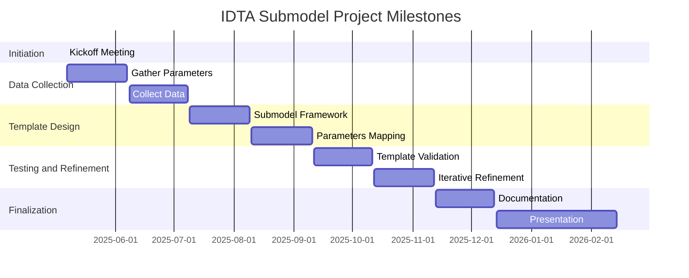

# IDTA Submodel for LPBF (Laser Powder Bed Fusion) Machines

## Overview
This repository contains the draft for an **IDTA submodel template** (formerly called: Metal 3D Printing Machine) designed to standardize data representation for **Laser Powder Bed Fusion (LPBF) metal additive manufacturing machines**. The template facilitates **interoperability**, **data exchange**, and **process optimization** within the digital twin ecosystem of additive manufacturing.

## Project Milestones

## Key Use Cases
1. **Machine Comparison & Selection** - Enables evaluation of LPBF machines based on standardized parameters.
2. **Process Optimization** - Helps fine-tune printing parameters for better efficiency and quality.
3. **Quality Control & Traceability** - Ensures reproducibility through structured data tracking.
4. **Process Monitoring** - Allows real-time tracking of machine status and environment.
5. **Data-Driven Process Improvement** - Supports historical data analysis for performance enhancement.
6. **Interoperability & Integration** - Facilitates seamless communication across systems and platforms.
7. **AI Integration for Cognitive Production** - Enables predictive maintenance and automated decision-making.

## Contribution
We welcome contributions to improve the **IDTA LPBF submodel**. If you have suggestions or wish to participate, feel free to open issues or submit pull requests.

---
### Contact & Further Information
- **Project Maintainers**: [Johannes Eckstein/NuCOS GmbH]
- **IDTA Documentation**: [https://industrialdigitaltwin.org/en/content-hub/submodels] 
- **IDTA Number**: 02033
- **Version**: 1.0 

This repository aims to **push forward interoperability, automation, and AI-driven advancements in additive manufacturing**. 🚀

